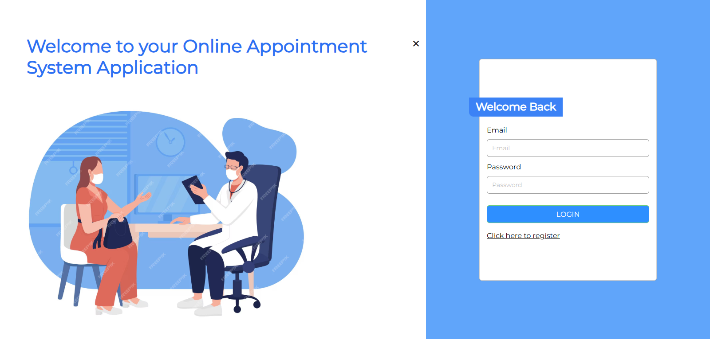
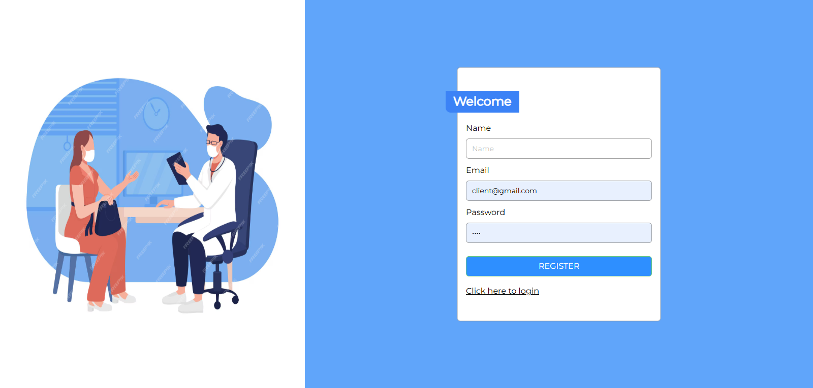
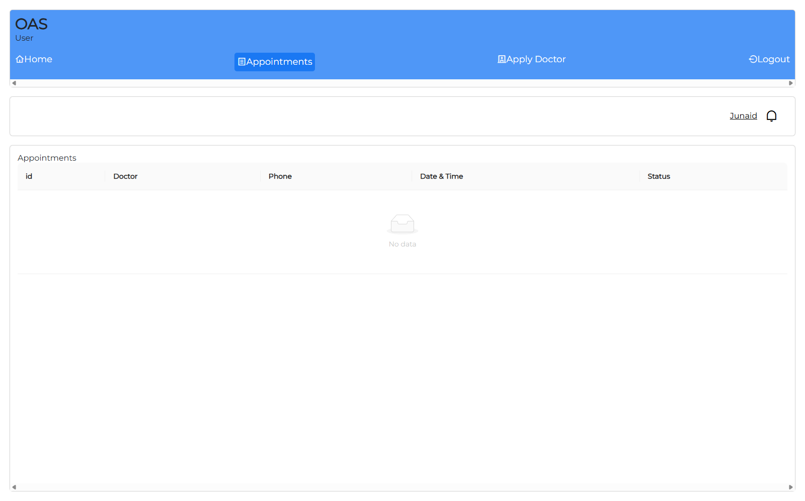

# 🩺 Online Appointment System (OAS)

A modern **MERN Stack** application that simplifies doctor-patient appointment management with secure authentication, real-time interactions, and role-based dashboards.

---

## 🖼️ Screenshots

### 🔐 Login Interface



### 📅 Register Interface



### 📝 Apply as Doctor


### 📅 View Appointments



---

## 🚀 Installation

To install all necessary dependencies:

```bash
npm install
```

---

## ▶️ Running the Application

### Start Frontend (React App)

```bash
npm start
```

### Start Backend (Node.js Server)

```bash
nodemon server.js
```

---

## 📖 Project Description

The **Online Appointment System (OAS)** is a full-stack web application that enables users to book appointments with doctors, while providing a streamlined approval process managed by administrators. Doctors can apply to offer services, and admins control approvals and availability.

---

## 🧩 Tech Stack

- **Frontend**: React.js, Bootstrap, CSS
- **Backend**: Node.js, Express.js
- **Database**: MongoDB
- **Authentication**: JWT, Role-based authorization

---

## 🔑 Core Features

- ✅ User authentication (register/login)
- 🔐 Role-based access control (Admin / Doctor / User)
- 🩺 Doctor application and approval system
- 📅 Appointment scheduling and status tracking
- 🔔 Notifications for actions like booking and approvals
- 📱 Responsive and clean UI

---

## 🔄 Application Workflow

### Admin Setup

- Register a new user.
- Manually set `isAdmin: true` in the user’s MongoDB record to give admin access.

### Doctor Application

- A registered user can apply to become a doctor via the “Apply Doctor” form.
- Admin receives a notification and approves the application.
- Once approved, the user becomes a doctor and is notified.

### Booking Appointments

- A user logs in and chooses a doctor and available time slot.
- The doctor receives a booking request and can accept or reject it.
- The user is notified about the booking status.

---

## 👥 Roles in the System

| Role   | Description                                                                     |
| ------ | ------------------------------------------------------------------------------- |
| Admin  | Can approve/reject doctor applications, manage appointments, and view all users |
| Doctor | Can manage availability and respond to appointment requests                     |
| User   | Can book appointments and apply to become a doctor                              |

---

## 📁 Project Structure

```
├── client/                  # React Frontend
├── server.js                # Node.js entry file
├── models/                  # MongoDB models
├── routes/                  # Express API routes
├── controllers/             # API logic
├── config/                  # Database & server config
├── screenshots/             # UI screenshots for README
└── README.md
```

---

## 💡 Tips for Use

- Make sure MongoDB is running locally or provide a connection string via `.env`.
- Set your JWT secret key in the `.env` file for authentication.
- You can use [MongoDB Compass](https://www.mongodb.com/products/compass) for easier database editing (e.g., setting `isAdmin` to `true`).

---
